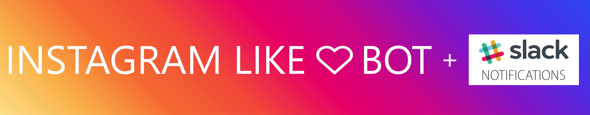

# Auto like my friends Instagram pics

Bot to automatically like your friends' Instagram posts, and notify you on your Slack channel.

### Practical use cases

 - You are like me. You don't have time to check social media and you want to give attention to someone so that their notices you

 How does it work?
================  
 This script runs Instagram API every 15 mins (cronjob) and checks for any new Instagram post of your followings. If a new a post is found it likes the post and sends a notification to your configured Slack channel using Slack Webhooks.

Installation
===============

 - `git clone https://github.com/o-shabashov/go-instabot.git`
 - `glide install` or `go get`
 - create a `.env` file. You must set `USERNAME`, `PASSWORD` and `SLACK` from [Slack Webhooks](https://api.slack.com/incoming-webhooks)
 - `go run main.go`
